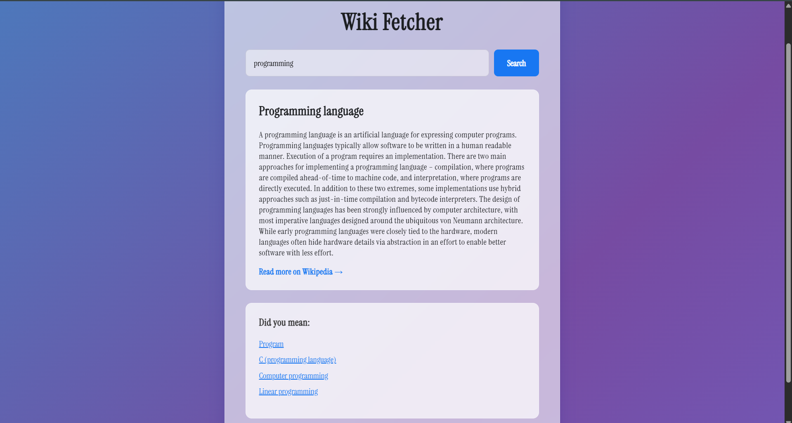

# Java Wikipedia Fetcher

A simple and elegant web application built with Java and Spring Boot that fetches and displays concise Wikipedia summaries. This tool intelligently handles ambiguous search terms to provide the most relevant article along with a list of alternative suggestions.



---

## 🌟 Key Features

-   **Instant Summaries:** Get the introduction of any Wikipedia article quickly.
-   **Intelligent Search:** Automatically handles ambiguous queries (e.g., searching "java" correctly finds "Java (programming language)").
-   **Disambiguation Handling:** Provides a list of alternative articles ("Did you mean...") if your initial query is too broad.
-   **Modern UI:** A clean, responsive, and visually appealing user interface with a dynamic gradient background and glassmorphism effects.
-   **RESTful Backend:** Built on a robust Spring Boot backend that communicates with the official MediaWiki API.

---

## 🛠️ Tech Stack

-   **Backend:**
    -   Java 17
    -   Spring Boot 3
    -   Spring Web
    -   Maven
-   **Frontend:**
    -   Thymeleaf
    -   HTML5
    -   CSS3
-   **API & Data Handling:**
    -   RestTemplate
    -   Jackson (for JSON parsing)

---

## 🚀 Getting Started

To get a local copy up and running, follow these simple steps.

### Prerequisites

You will need the following software installed on your machine:
-   Java Development Kit (JDK) 17 or newer
-   Apache Maven

### Installation & Running

1.  **Clone the repository:**
    ```bash
    git clone [https://github.com/yajneshx94/java-wikipedia-fetcher.git](https://github.com/yajneshx94/java-wikipedia-fetcher.git)
    ```

2.  **Navigate into the project directory:**
    ```bash
    cd java-wikipedia-fetcher
    ```

3.  **Run the application using Maven:**
    ```bash
    mvn spring-boot-run
    ```

4.  **Open your browser:**
    Navigate to `http://localhost:8080` to see the application live.

---

## ✒️ Author

**Yajnesh K**
-   **GitHub:** [@yajneshx94](https://github.com/yajneshx94)